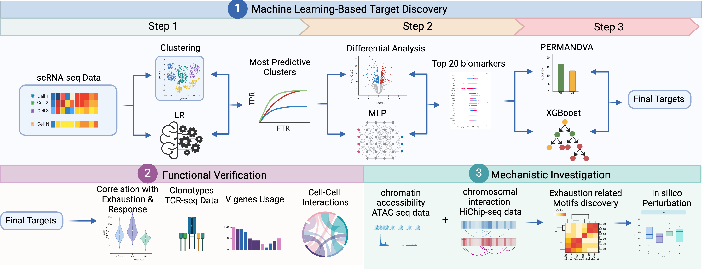

# Multi-omics Analysis of CAR-T Resistance



## Analysis Workflow

### 1. Target Discovery
**Purpose:** Identify key resistance markers from single-cell RNA sequencing data

**Methods:**
* Elastic net to find predictive clusters
* Differential analysis for variable genes
* MLP + SHAP for top 20 biomarkers
* PERMANOVA + XGBoost for final gene pairs

### 2. Functional Verification
**Purpose:** Validate identified markers through functional genomics

**Methods:**
* Exhaustion marker profiling
* TCR repertoire analysis
* V gene usage patterns
* Cell-cell communication analysis

### 3. Mechanistic Investigation
**Purpose:** Understand regulatory mechanisms controlling resistance genes

**Methods:**
* ATAC-seq for chromatin accessibility
* HiChIP-seq for enhancer mapping
* 3D genome structure analysis
* Motif scanning
* In silico perturbation

## Repository Structure
```bash
.
├── 00_preprocessing/      # Data preprocessing scripts
├── 01_ml_models/         # Machine learning models for target identification
├── 02_tcr_ccc_analysis/  # TCR and cell-cell communication analysis
├── 03_atac_analysis/     # ATAC-seq data analysis
├── 04_hichip_analysis/   # HiChIP data analysis
└── 05_visualization/     # Visualization scripts and supplementary materials
```
